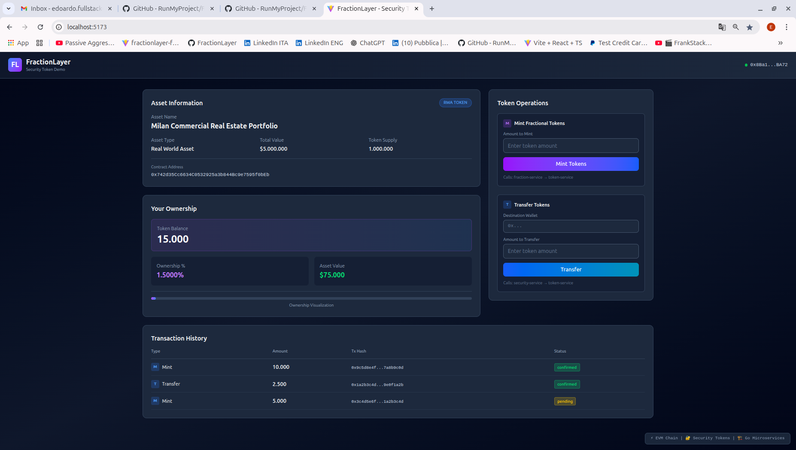

# FractionLayer – Security-Token Platform  
*Epiphany (Befana) Release – 5 January 2026*

**Happy New Year 2026!**  
May the coming twelve months bring fresh commits, green pipelines and zero-critical bugs.  
As the Wise Men followed the star, we follow the **next shiny tech stack** – and today it leads us to **FractionLayer v1.0-dark**.

  
*First full render of the security-token demo with Tailwind 4 + Vite (React 19) dark theme enabled.*

---

## 🧦🧹 Befana Bonus – Ambient Study Kit
While others binge-watch, we binge-*build*.  
Grab your **Epiphany socks** (to keep your feet warm during late-night coding) and your **digital broom** (to sweep away legacy tech debt) – we’re mastering:
- **Go micro-services** for rock-solid backends  
- **React 19** frontends that feel like Netflix-grade UX (but actually *do* stuff)  
- **Zero-Knowledge proofs** – because privacy is the new black  
- **AWS/KMS/SQS** – the real cloud deal, not just console clicking  
- **Docker + Terraform** – ship & scale like the pros  

*Studying hard today so tomorrow we can gift Italy (and the world) fintech that doesn’t break when someone actually uses it.*

---

## 🎁 What’s under the hood today
- React 19 SPA with **operator & investor views**
- Go micro-services scaffold (API-gateway, asset, token, ledger, KMS-adapter, ZK-service, FHE-crypto)
- AWS LocalStack for **KMS / SQS / SNS** simulation
- Hardhat local EVM node – **smart-contracts ready**
- PostgreSQL **immutable audit ledger**
- Docker-compose **one-liner** spin-up
- Terraform & SAM IaC templates
- Zero-Knowledge + FHE placeholders (Lattigo, snarkjs)
- **OWASP-grade** security headers, rate-limit, JWT wallet-auth

---

## 🧭 Next gifts (road-map)
1. React-Router – navigate _AssetList → Detail → DeveloperView_
2. Wire real Go endpoints to `frontend/src/services/api.js`
3. KMS signing flow with key-rotation
4. ZK-proof pipeline (circom → snarkjs → on-chain verify)
5. FHE computation service (Lattigo)
6. GitHub-Actions CI + Docker build-push
7. Deploy on Vercel / AWS ECS

---

## 🚀 Quick start – just one command
```bash
git clone https://github.com/RunMyProject/FractionLayer.git
cd fractionlayer
./deployFractionLayer.sh        # builds & runs everything
```
Open http://localhost:3000 – **dark-mode magic** in your browser.

---

## 📦 Previous technical documents
For the **original architecture overview, requirements mapping and 02-Jan-2026 deep-dive**, see:  
[README-02Jan2026.md](docs/archive/README-02Jan2026.md)

---

**Buona Epifania to the Italians, Happy Epiphany to the world!**  
⭐ May every bug be revealed – and every feature shine like a star. ⭐

*Milan, 5 January 2026 – Edoardo*
